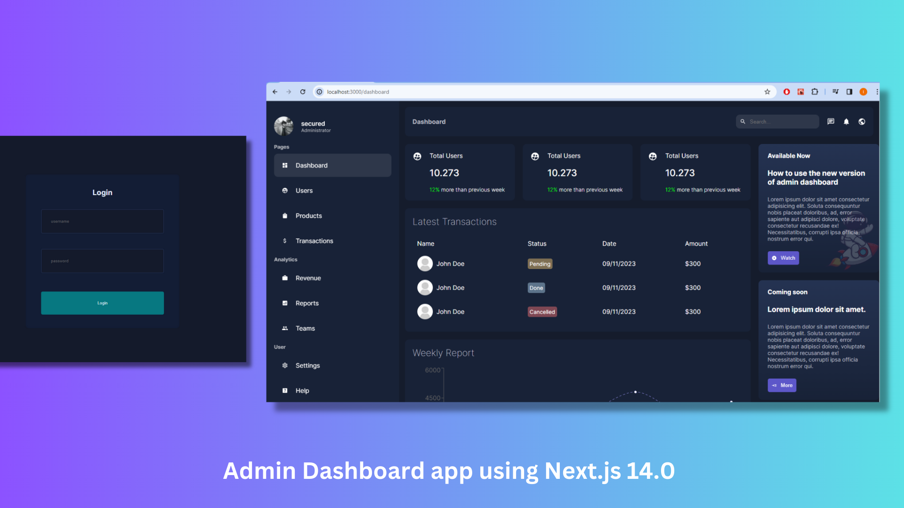

## A simple Admin Dashboard app using Next.js 14.0



- Check the project [hosted on vercel](https://nextjs-admin-red.vercel.app/dashboard)

### What I learned
- Install Next.js
- Create Pages, Components etc. Use CSS modules for individual pages.
- Use auth.js library for authentication using the username and password
- what are server actions
- Deploy on vercel

## Getting Started

- Clone the repository
- Create a DB on mongo db
- Create .env file at the root.

```bash
MONGO=mongodb+srv://<username>:<password>@cluster0.xxxxx.mongodb.net/dashboard?retryWrites=true&w=majority
AUTH_SECRET=secretkeyofyourchoice
AUTH_URL=http://localhost:3000/api/auth
```

- Install all the dependencies and then run dev
```bash
npm install
npm run dev
```


Open [http://localhost:3000/login](http://localhost:3000/login) with your browser to see the result.
- Login using username `secured` and password `123456`

- If not redirected to dashboard page, you can then visit
- [Dashboard](http://localhost:3000/dashboard)
- [Users page](http://localhost:3000/dashboard/users) and 
- [Products page](http://localhost:3000/dashboard/products)

